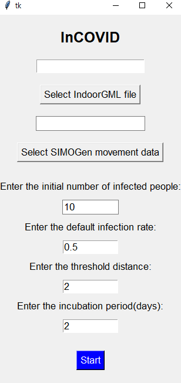

[](LICENSE)


<br />
<p align="center">
    
  </a>

  <h3 align="center">InCOVID - Virus propagation model in indoor space</h3>
  <p align="center">
   InCOVID is intended to show how the virus can spread in indoor space and visualize it in 3D using Indoor GML data.
  </p>
</p>

 

## Dependencies
[SIMOGen](https://github.com/STEMLab/SIMOGen) : To generate objects movement data


## Prerequisites
- Python 3.7
- Java Development Kit 8 (JDK 8)
- [Apache Maven 3.x](https://maven.apache.org/download.cgi)


## Getting Started

- To install the packages type in the console
```
$ pip install -r requirements.txt
```
- To run the program
```
$ cd src
$ python InCOVID.py
```

## Usage


1) Push "Select IndoorGML data file(3D version)" button
2) Select IndoorGML data file
3) Push "Select SIMOGen movement data" button
4) Select object movement data created using SIMOGen
5) Enter initial number of infected people
6) Enter the default infection rate
7) Enter the threshold distance
5) Push "Start" button

## Main Features
- Visualization of virus propagation model in 3D
- Timeline of the infection cases  
- Graph representations of the infection data
- Possibility to see infection case coordinates in the indoor space 


   
## Author

| Name| E-mail | Affiliation |
| ------ | ------ |------ |
| Arman Assankhanov | [arman@pusan.ac.kr](arman@pusan.ac.kr) | Pusan National University |


License
----

[MIT License](https://choosealicense.com/licenses/mit/)
